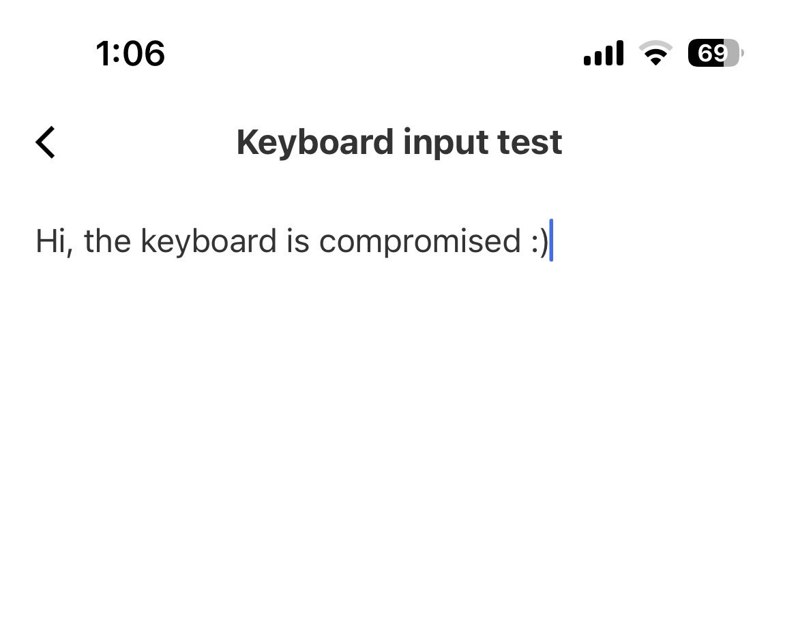

# AirKeyboard iOS App 1.0.5 – Remote Input Injection

## 📌 Description
The AirKeyboard iOS application exposes an unauthenticated WebSocket service
on port **8888**, allowing any device on the same network to inject arbitrary
keyboard input into the victim’s iOS device.

---

## 👤 Credit
**Original Vulnerability Author:** Chokri Hammedi  

I have **retested the vulnerability** and **shortened the exploit code**
to make it easy for beginners and researchers with no coding experience.

---

## 🧪 Vulnerability Details
- Platform: iOS
- Affected Version: 1.0.5
- Tested On: iOS 18.5
- Protocol: WebSocket
- Port: 8888
- Authentication: ❌ None

---

## 📸 Proof of Concept Screenshots

### Exploit Execution


### AirKeyboard App Running on Victim


## 🛠 How to Use (Beginner Friendly)

### Install Python 3
```bash
python3 --version
pip install websocket-client
python3 airkey_exploit.py


